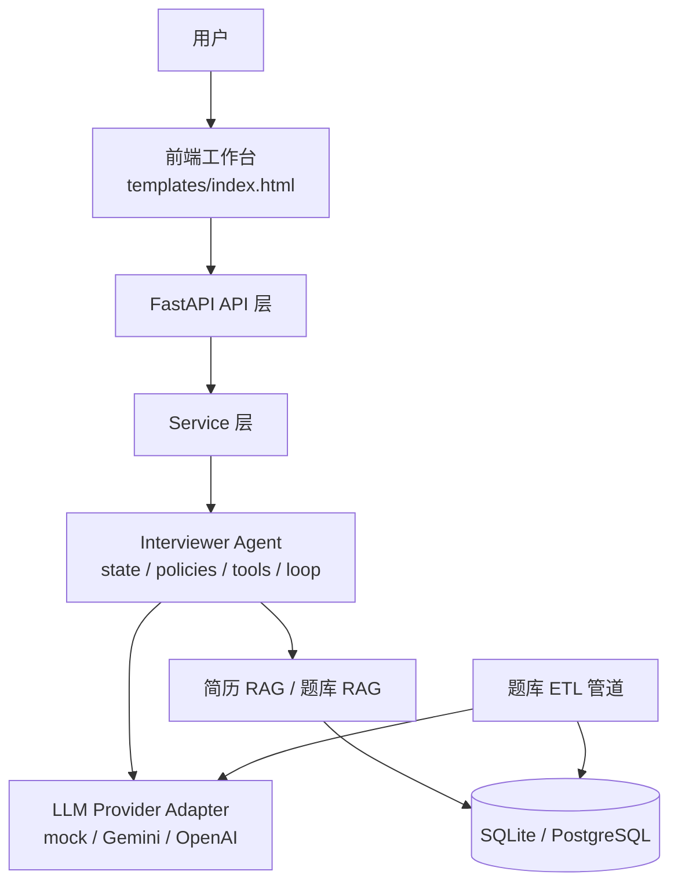
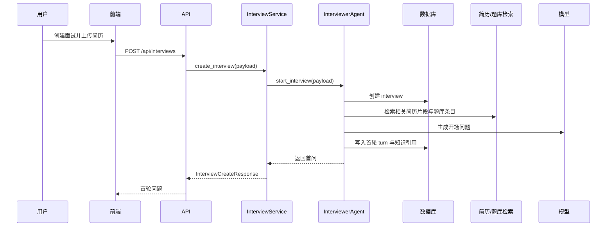
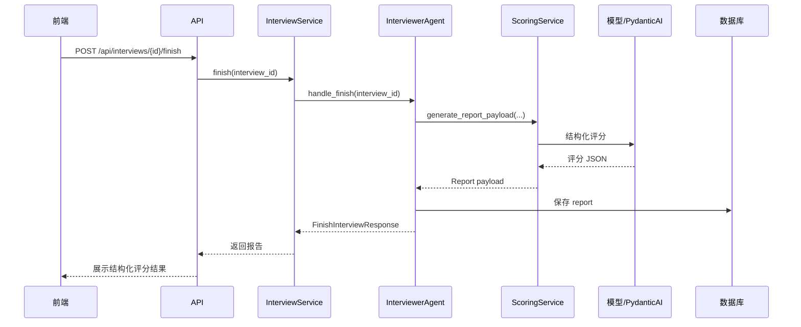
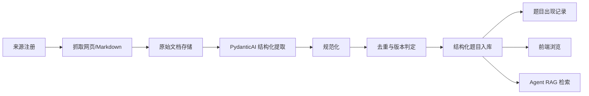

# 架构说明

本文档描述 `Interviewer Agent` 项目的当前架构、关键数据流、核心设计取舍以及后续演进方向。

## 1. 架构目标
项目的核心目标不是构建一个“会调用大模型的网页应用”，而是构建一个真正可控的面试官 Agent。它需要同时具备：
- 面试流程理解能力
- 状态与记忆管理能力
- 知识检索能力
- 简历理解能力
- 结构化评分能力
- 可追溯、可扩展的题库采集能力

换句话说，这个系统需要同时回答两类问题：
- 对候选人：如何进行一场像真的技术面试
- 对系统自身：如何把面试过程、知识来源、评分结果都结构化和持久化

## 2. 系统总览

系统可以从职责上分为 7 层：
1. 前端工作台
2. API 层
3. Service 层
4. Agent 核心层
5. LLM / Infra 层
6. 数据持久化层
7. 题库 ETL 层

## 3. 分层结构

### 3.1 前端工作台
文件：
- `D:\CS\interviewer-agent-mvp\templates\index.html`

职责：
- 创建面试
- 上传并解析简历
- 展示结构化简历画像
- 与面试 Agent 进行多轮问答
- 展示每轮参考的题库与简历引用
- 展示评分报告
- 浏览题库
- 切换运行时模型配置

特点：
- 原生 HTML / CSS / JavaScript
- 不依赖 React/Vue
- 适合快速演示、调试与产品原型迭代

### 3.2 API 层
入口：
- `D:\CS\interviewer-agent-mvp\app\main.py`
- `D:\CS\interviewer-agent-mvp\app\api\router.py`

主要路由：
- 面试：`D:\CS\interviewer-agent-mvp\app\api\routes\interviews.py`
- 报告：`D:\CS\interviewer-agent-mvp\app\api\routes\reports.py`
- 简历：`D:\CS\interviewer-agent-mvp\app\api\routes\resume.py`
- 题库：`D:\CS\interviewer-agent-mvp\app\api\routes\question_bank.py`
- 运行时配置：`D:\CS\interviewer-agent-mvp\app\api\routes\runtime.py`
- 健康检查：`D:\CS\interviewer-agent-mvp\app\api\routes\health.py`
- Web 首页：`D:\CS\interviewer-agent-mvp\app\api\routes\web.py`

职责：
- 对外提供 HTTP API
- 做输入输出校验
- 依赖注入 Service
- 将异常转换为 API 响应

### 3.3 Service 层
核心文件：
- `D:\CS\interviewer-agent-mvp\app\domain\services\interview_service.py`
- `D:\CS\interviewer-agent-mvp\app\domain\services\scoring_service.py`
- `D:\CS\interviewer-agent-mvp\app\domain\services\report_service.py`
- `D:\CS\interviewer-agent-mvp\app\domain\services\resume_parser_service.py`
- `D:\CS\interviewer-agent-mvp\app\domain\services\resume_rag_service.py`
- `D:\CS\interviewer-agent-mvp\app\domain\services\question_rag_service.py`
- `D:\CS\interviewer-agent-mvp\app\domain\services\question_bank_service.py`

职责：
- 组装业务上下文
- 为 API 层提供清晰的业务能力入口
- 管理评分、报告、题库采集、简历解析等通用服务

设计原则：
- `InterviewService` 只做薄编排，不承担 Agent 的全部决策逻辑
- 复杂决策应下沉到 Agent 层
- ETL 和检索能力作为独立服务存在，避免耦合到面试流程中

### 3.4 Agent 核心层
核心目录：
- `D:\CS\interviewer-agent-mvp\app\agent\state.py`
- `D:\CS\interviewer-agent-mvp\app\agent\policies.py`
- `D:\CS\interviewer-agent-mvp\app\agent\tools.py`
- `D:\CS\interviewer-agent-mvp\app\agent\loop.py`

这是项目和普通 LLM Web 应用最大的区别。

#### State
`state.py` 负责表达当前面试状态，包括：
- 当前 interview 基本信息
- 已有 turns
- 当前阶段
- 阶段计划
- 剩余轮次 / 预计剩余时间
- 已生成的报告
- 简历画像和检索结果的上下文视图

#### Policies
`policies.py` 负责决定“下一步该做什么”，例如：
- 当前是否应该继续追问
- 是否应结束项目阶段并切换到八股阶段
- 是否应进入手撕题阶段
- 是否已满足评分条件

#### Tools
`tools.py` 将 Agent 能做的动作显式化，例如：
- 创建面试记录
- 读取面试状态
- 生成开场问题
- 生成追问问题
- 记录候选人回答
- 持久化 turn
- 生成报告
- 检索题库
- 检索简历片段

这部分非常关键，因为它把“Agent 行为”从普通函数调用提升成了“可管理工具集”。

#### Loop
`loop.py` 是面试官 Agent 的主循环，负责：
- 读取状态
- 根据 policies 决策
- 调用 tools 执行动作
- 更新数据库状态
- 返回当前回合结果

### 3.5 LLM / Infra 层
目录：
- `D:\CS\interviewer-agent-mvp\app\infra\llm\`
- `D:\CS\interviewer-agent-mvp\app\infra\question_bank\`
- `D:\CS\interviewer-agent-mvp\app\infra\repositories\`

#### LLM Provider Adapter
文件：
- `base.py`
- `mock_provider.py`
- `gemini_provider.py`
- `openai_provider.py`
- `registry.py`

职责：
- 屏蔽不同模型 SDK 的差异
- 对上提供统一生成接口
- 支撑前端运行时切换 Provider

#### Question Bank Infra
文件：
- `crawler.py`
- `extractor.py`

职责：
- 抓取网页或 Markdown 内容
- 用 `PydanticAI` 将非结构化文本转为结构化面试题

#### Repositories
职责：
- 持久化 `interview / turn / report / question bank` 等数据
- 将 ORM 操作与业务逻辑解耦

### 3.6 数据持久化层
#### 当前存储策略
- 默认本地开发：SQLite
- 目标生产主库：PostgreSQL

#### 基础设施
- `D:\CS\interviewer-agent-mvp\app\db\base.py`
- `D:\CS\interviewer-agent-mvp\app\db\session.py`

#### 面试相关核心表
- `Interview`
- `Turn`
- `Report`

对应模型：
- `D:\CS\interviewer-agent-mvp\app\db\models\interview.py`
- `D:\CS\interviewer-agent-mvp\app\db\models\turn.py`
- `D:\CS\interviewer-agent-mvp\app\db\models\report.py`

#### 题库 ETL 相关核心表
- `QuestionSource`
- `QuestionCollectionJob`
- `RawQuestionDocument`
- `StructuredQuestion`
- `QuestionOccurrence`

对应模型：
- `D:\CS\interviewer-agent-mvp\app\db\models\question_source.py`
- `D:\CS\interviewer-agent-mvp\app\db\models\question_collection_job.py`
- `D:\CS\interviewer-agent-mvp\app\db\models\raw_question_document.py`
- `D:\CS\interviewer-agent-mvp\app\db\models\structured_question.py`
- `D:\CS\interviewer-agent-mvp\app\db\models\question_occurrence.py`

### 3.7 配置与 Prompt 层
文件：
- `D:\CS\interviewer-agent-mvp\app\core\config.py`
- `D:\CS\interviewer-agent-mvp\app\core\runtime_settings.py`
- `D:\CS\interviewer-agent-mvp\app\core\prompts.py`

Prompt 目录：
- `D:\CS\interviewer-agent-mvp\app\prompts\versions\v1\`

职责：
- 统一维护全局配置
- 支持前端运行时覆盖 Provider / 模型 / Prompt 版本 / 评分后端
- 独立维护多版本 Prompt

## 4. 面试主链路

### 4.1 创建面试

### 4.2 继续追问
每一轮回复时，Agent 会：
1. 读取当前 turn 与 interview 状态
2. 记录候选人的回答
3. 判断当前是否应该继续本阶段追问
4. 如果应该切阶段，生成 wrap-up 过渡问法
5. 再次结合题库与简历进行 RAG
6. 生成下一问并持久化知识引用

### 4.3 结束与评分

## 5. 面试节奏控制
当前 Agent 不是简单“问满 N 轮”，而是按照阶段推进：
1. 自我介绍
2. 项目 / 实习深挖
3. 八股基础
4. LeetCode / 手撕题

设计目标：
- 使体验更接近真实技术面试
- 防止模型在错误阶段继续深挖旧话题
- 通过显式 wrap-up 提升转场自然度

当前策略：
- 基于 `max_turns` 与预估总时长进行节奏控制
- 不同级别控制问题深度
- 阶段边界由 Agent 显式切换

下一步可继续升级为：
- 基于真实墙钟时间控制节奏
- 根据候选人回答质量动态压缩或扩展阶段

## 6. 简历理解链路

### 当前输入支持
- PDF
- DOCX
- TXT
- Markdown

### 处理流程
1. 文件读取
2. 编码修复与文本清洗
3. 提取 resume text
4. 生成结构化 `ResumeProfile`
5. 切分 resume chunk / project / experience 片段
6. 供 Agent 检索与提问使用

### 当前设计特点
- 同时保留原始文本与结构化画像
- 既能做项目级追问，也能做段落级 RAG
- 前端可显示结构化简历画像与“本轮参考简历”

## 7. 题库 ETL 与知识库设计

### 为什么题库不能只是一张表
因为题库不仅要“给前端看”，还要：
- 持续从互联网采集
- 对原始文档可追溯
- 对同一题去重和版本化
- 为 RAG 检索提供稳定底座
- 为 Agent 提供可解释的知识来源

因此题库被拆分成 ETL 原始库 + 结构化题库。

### ETL 流程

### 核心设计点
#### 来源注册
- 记录来源类型、基础 URL、抓取策略、语言、是否启用

#### 原始文档持久化
- 保存抓取下来的 markdown
- 使用 `content_hash` 判断文档是否变化
- 保存 `document_version`

#### 题目去重
- 使用 `canonical_hash` 标识“是否是同一道题”
- 使用 `content_hash` 标识“同题内容是否变化”

#### 版本化
- 同题但内容变化时，旧版本失活，新版本生效

#### occurrence
- 记录一道题出现在多少来源/多少文档中
- 为来源追溯和后续运营分析提供基础

## 8. RAG 设计
当前已经实现轻量 RAG，主要用于两类知识：
- 题库知识
- 简历知识

### 8.1 题库 RAG
职责：
- 在 Agent 出题前召回相关题目
- 将召回结果作为 prompt grounding
- 在前端展示“本轮参考题库”

### 8.2 简历 RAG
职责：
- 在 Agent 出题前召回相关简历片段
- 保证问题更贴近候选人项目和经历
- 在前端展示“本轮参考简历”

### 当前取舍
当前检索仍偏轻量，优点是：
- 本地开发简单
- 便于快速验证 Agent 流程
- 不依赖额外向量基础设施

后续推荐方向：
- PostgreSQL + pgvector
- 或 PostgreSQL + Milvus

## 9. 运行时配置设计
前端可以动态切换：
- Provider：`mock / gemini / openai`
- 模型名
- Prompt 版本
- 评分后端：`provider / pydanticai`

实现位置：
- `D:\CS\interviewer-agent-mvp\app\core\runtime_settings.py`
- `D:\CS\interviewer-agent-mvp\app\api\routes\runtime.py`

设计价值：
- 便于演示和联调
- 不需要每次改 `.env` 后重启
- 能在同一个系统里快速验证不同模型效果

## 10. 兼容性与演进策略
当前项目处于快速演进阶段，因此采用了“先保证可运行，再逐步正式化”的策略。

### 已采用的兼容方案
- 启动时自动补部分运行时 schema
- 启动时回填旧题库数据到新 ETL 结构
- 保留对 SQLite 的良好支持
- 保留 `mock` provider，避免开发环境强依赖真实模型

### 当前仍建议补齐
- Alembic 正式迁移体系
- 更稳定的任务队列 / 异步采集框架
- 更正式的向量检索层

## 11. 当前最大优势
1. 不是简单调用 LLM，而是有明确的 Agent 结构
2. 面试流程、知识检索、简历理解、评分已经真正串起来
3. 题库不是 demo 表，而是可持续扩展的 ETL 底座
4. 用户与 Agent 双视角都被照顾到：既能面试，也能复习
5. 具备继续产品化的良好基础

## 12. 当前主要残余风险
1. 数据库迁移体系仍不够正式
2. 题库抽取质量受模型稳定性影响
3. 长网页/复杂目录页可能导致结构化抽取校验失败
4. 题库检索目前还不是最终版 semantic RAG
5. 前端仍偏“工程工作台”风格，产品化程度有限

## 13. 后续演进建议
### 短期
- 为题库页补搜索、筛选、来源、版本、出现次数展示
- 为采集任务补前端运营入口
- 增加失败重试与采集监控

### 中期
- 接入 PostgreSQL 正式主库
- 引入 Alembic
- 将题库检索升级为向量检索

### 长期
- 支持更细粒度岗位画像
- 支持多套岗位 Prompt 与题库策略
- 引入真实面试时间控制
- 支持多 Agent 协作面试或面试复盘 Agent

## 14. 一句话总结
这个项目当前已经从一个“AI 面试网页原型”，演进成了一个：

**支持简历驱动、题库驱动、流程控制、结构化评分与持续题库采集的技术面试官 Agent 系统。**
